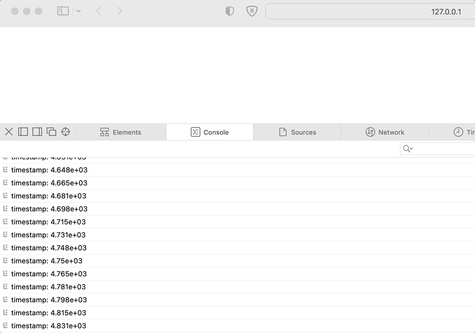

# zig-wasm-logger

A simple implementation of `console.log()` in Zig + JS + Wasm.

https://daneelsan.github.io/zig-wasm-logger/



## Usage

```zig
const JS = @import("JS.zig");

/// Print `args` formatted by `format` into Javascript's console.
JS.Console.log(format, args)
```

Example:

```zig
const JS = @import("JS.zig");

export fn step(timestamp: f32) void {
    JS.Console.log("timestamp: {}\n", .{timestamp});
}
```

## Build

```shell
$ zig version
0.14.0
```

```shell
$ zig build --verbose
```

```shell
$ ls zig-out/bin/*.wasm
zig-out/bin/example.wasm
```

## References

-   https://github.com/daneelsan/minimal-zig-wasm-canvas
-   https://github.com/daneelsan/zig-wefx
-   https://github.com/ziglang/zig/blob/master/lib/std/io/writer.zig
-   https://github.com/hexops/mach/blob/main/src/platform/wasm.zig
-   https://github.com/hexops/mach/blob/main/src/platform/mach.js
